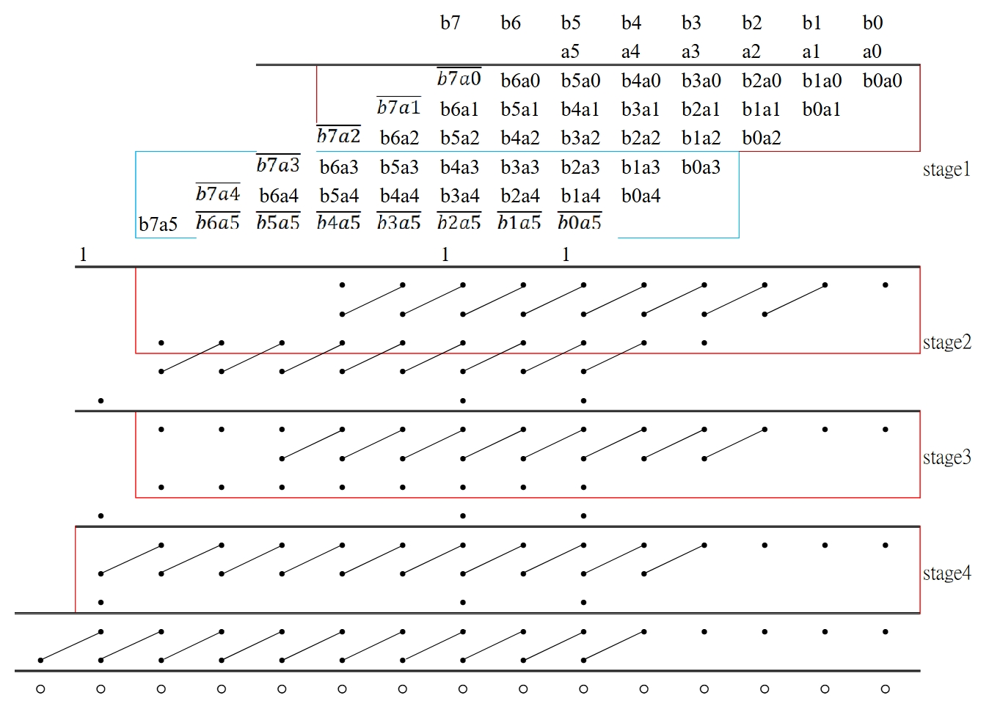
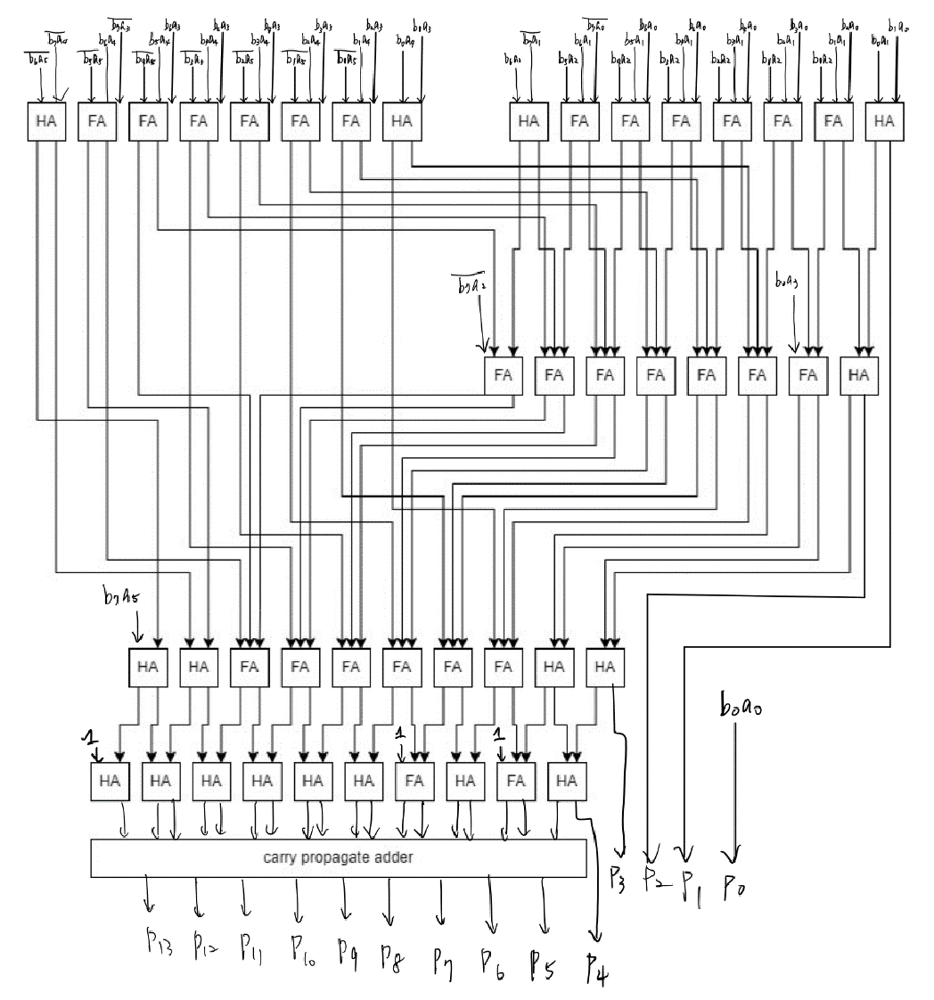
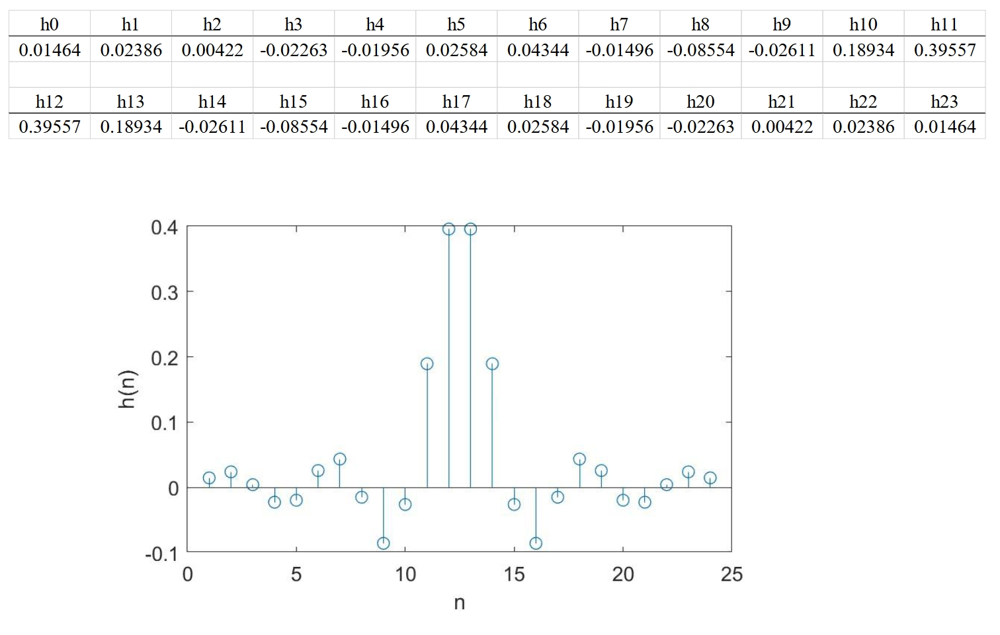
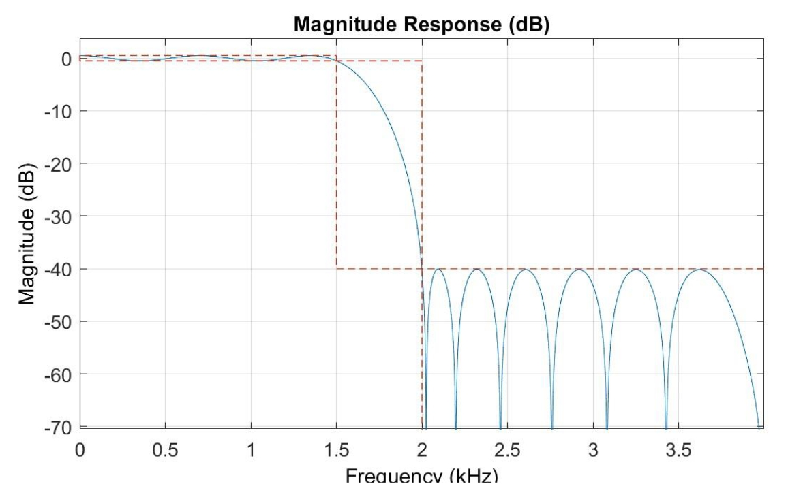
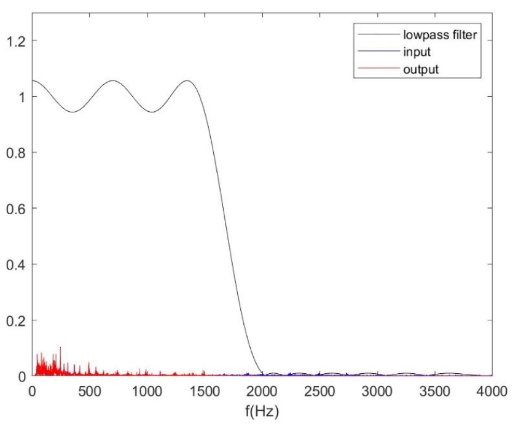
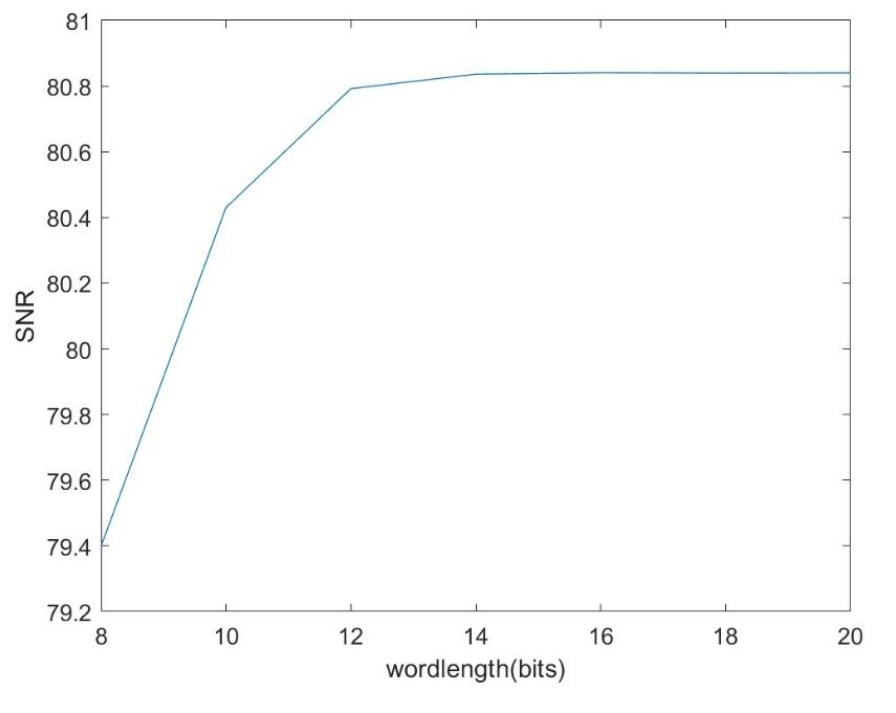

# DSP-Circuit-Design-Projects

This repository contains hardware and simulation projects for digital signal processing circuits, including multipliers and low-pass filters. The projects demonstrate both floating-point and fixed-point implementations as well as Verilog-based hardware designs.

---

## 1. Baugh-Wooley Multiplier

- **Description:** Implementation of a 8x6 Baugh-Wooley multiplier in Verilog.
- **Files:** `verilog_code/Baugh-Wooley_multiplier/`

  

  

---

## 2. Low-Pass Filter Design

### a. Floating-Point Simulation
- **Description:** Design and simulation of low-pass FIR filter using floating-point arithmetic in MATLAB.
- **File:** `matlab_code/filter_design.m`

  

  

  

### b. Fixed-Point Simulation
- **Description:** Fixed-point simulation of the FIR filter to evaluate quantization effects.
- **File:** `matlab_code/fixed-point.m`

  

### c. Verilog Code Simulation
- **Description:** Hardware implementation of FIR filter in Verilog and simulation with testbench.
- **Files:** `verilog_code/Low-pass_filter_design/`

### d. Verification
- **Description:** Verification script to compare fixed-point MATLAB simulation and Verilog simulation results.
- **File:** `verilog_code/Low-pass_filter_design/do_fir/check.m`
